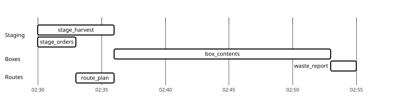

---
# Test fixture for the Hugo templates (ISS-45, used by ISS-46). Never publish.
# Fernhill Growers is invented. Nothing here comes from a client system.
title: The lineage is already in the SQL
author: Ben Hall
date: 2026-09-15
draft: true
cluster: Generated diagrams
summary: Every job in a small warehouse says what it reads and what it writes. Parse the SQL, write DOT, and the lineage diagram stops being something anyone has to keep up to date.
---

Lineage diagrams tend to get drawn once, for an audit or a new starter, and
then left alone. The SQL they describe keeps changing. A year later the
diagram is a record of what someone believed on the day they drew it.

The warehouse doesn't have to believe anything. Each job creates one table from
some others, and it says which in its own SQL. That is a list of edges, and a
list of edges is a graph.

The example here is Fernhill Growers, a co-operative of market gardens that
sells weekly vegetable boxes. It doesn't exist, which is why its data is so
tidy.

## What the warehouse runs

Fernhill's warehouse is one DuckDB file, rebuilt every night by five jobs. The
jobs are listed in a YAML file that the runner reads:

```yaml
schedule: "30 2 * * *"                     # (1)
warehouse: fernhill.duckdb

jobs:
  - name: stage_harvest
    sql: sql/stage_harvest.sql
  - name: stage_orders
    sql: sql/stage_orders.sql
  - name: box_contents
    sql: sql/box_contents.sql
    after: [stage_harvest, stage_orders]   # (2)
  - name: route_plan
    sql: sql/route_plan.sql
    after: [stage_orders]
  - name: waste_report
    sql: sql/waste_report.sql
    after: [box_contents]
    owner: accounts@fernhill.example       # (3)
```

1. 02:30, which is after the growers' tablets have synced the day's harvest
   and before anyone packs a box.
2. `after` is the only dependency information a person writes down. It
   controls run order, and nothing checks it against what the SQL reads.
3. The owner isn't used by the runner. People open this file to find out who
   to ask, so it lives here anyway.

Before this file existed, the box table was called
`fernhill_weekly_box_contents_packed_weight_by_order_v2_final`. The rename is
the only migration in this post that nobody argued about.

## Read the lineage out of the SQL

Here is the job that plans the delivery routes. It needs the packed weight of
each box, so the vans aren't overloaded:

```sql
-- route_plan: one row per delivery stop, in van order
CREATE OR REPLACE TABLE route_plan AS
SELECT
    o.delivery_date,
    o.van_id,
    o.stop_sequence,
    o.customer_postcode,
    SUM(b.packed_weight_kg) AS load_kg
FROM stage_orders AS o
JOIN box_contents AS b
  ON b.order_id = o.order_id
WHERE o.delivery_date = current_date + INTERVAL 1 DAY AND o.status NOT IN ('cancelled', 'paused', 'skipped_holiday')
GROUP BY o.delivery_date, o.van_id, o.stop_sequence, o.customer_postcode
ORDER BY o.van_id, o.stop_sequence;
```

It reads `stage_orders` and `box_contents`. The YAML says it runs after
`stage_orders` only. Keep that in mind.

I don't want to read five SQL files by eye, and neither do you. sqlglot parses
SQL into a tree, and the tree knows which table is being created and which
tables are read:

```python
"""Write the table lineage of the Fernhill jobs as DOT."""
import sys
from pathlib import Path

import sqlglot
import yaml
from sqlglot import exp


def tables(sql: str) -> tuple[str, set[str]]:
    tree = sqlglot.parse_one(sql, read="duckdb")
    target = tree.this.name
    sources = {t.name for t in tree.expression.find_all(exp.Table)}  # (1)
    return target, sources - {target}


def main(jobs_file: Path) -> None:
    jobs = yaml.safe_load(jobs_file.read_text())["jobs"]
    print("digraph lineage {")
    print("  graph [rankdir=LR];")
    for job in jobs:
        sql = (jobs_file.parent / job["sql"]).read_text()
        target, sources = tables(sql)
        for source in sorted(sources):
            print(f"  {source} -> {target};")  # (2)
    print("}")


if __name__ == "__main__":
    main(Path(sys.argv[1]))
```

1. A CTE shows up here as a table too. Fernhill's SQL doesn't use any. Yours
   will, so subtract `{cte.alias for cte in tree.find_all(exp.CTE)}` as well.
2. No labels and no styling. The script's only job is the edges.

> [!NOTE]
> sqlglot reads most SQL dialects. The example uses DuckDB. For Snowflake or
> Postgres, only `read=` changes.

> [!CAUTION]
> `t.name` drops the schema, so `raw.orders` and `staging.orders` become the
> same node. That's fine for Fernhill, which has one schema. Anywhere else, use
> `exp.table_name(t)`, which keeps the qualified name.

## Draw it

```console
$ python lineage.py jobs.yml > lineage.dot
$ grep -c -- '->' lineage.dot
8
$ dot -Tsvg lineage.dot -o lineage.svg
```

The DOT file is small enough to read, and it diffs cleanly when a job
changes:

{}

The two `external` tables are loaded from outside the warehouse, and the
`highlight` edge is the one `jobs.yml` doesn't know about. The site's diagram
style draws them dashed and in the accent colour.



A few terms, since the rest of the post leans on them:

lineage
: Which tables a table is built from. Here it comes from the SQL.

run order
: Which jobs start after which. Here it comes from `after` in `jobs.yml`, which
  a person writes.

writer
: The one job whose SQL creates a table. The check below assumes every table
  has exactly one, and stops if two jobs claim the same table.

## The night it mattered

On 14 August, a grower synced a late harvest and `stage_harvest` took six
minutes instead of the usual three. `box_contents` waited for it, as `after`
says it should. `route_plan` didn't wait, because nothing told it to.

{}



> [!WARNING]
> A job that reads a stale table still succeeds. Nothing in the run log for 14
> August says anything went wrong. The vans were loaded against the previous
> night's box weights, and the first sign was a driver phoning in from a
> weigh station.

On most nights `box_contents` had finished first by luck. The lineage graph
showed the problem the first time anyone looked at it, which says more about
how often lineage diagrams get looked at than about the graph.

## Check the order before it merges

The graph and `jobs.yml` should agree. For every edge `source -> job`, the
job has to run after whichever job writes `source`, either directly or through
a chain of `after`. The chain matters: `waste_report` reads `stage_harvest`
but only lists `box_contents`, and that's correct, because `box_contents`
already runs after `stage_harvest`.

{}



```console
$ python check_order.py jobs.yml
route_plan reads box_contents, but does not run after box_contents
1 ordering problem in 5 jobs
$ echo $?
1
```

The fix was one word in `jobs.yml`. Finding it took a phone call from a weigh
station.

> [!TIP]
> Run the check on pull requests, not on the nightly schedule. By the time the
> nightly run could tell you, the vans have already left.

> [!IMPORTANT]
> The graph only covers what the parser can see. A job that runs Python, or
> that builds its SQL with string formatting, has lineage that sqlglot can't
> read. Keep a short list of those jobs and check them by hand.

## Three renderers on one page

This post uses three diagram languages, because Fernhill's problem has three
shapes. Each one needed something different to follow the page's light and
dark themes:

| Language | Source beside this post | Diagram | Layout | Colours set in | Accent | Needs at build time |
|---|---|---|---|---|---|---|
| DOT | `figures/lineage.dot` | Directed graph | Automatic, ranked left to right | Graph, node and edge attributes | `color` on one edge | Graphviz `dot` |
| PlantUML | `figures/order-check.puml` | Activity | Top to bottom, in the order written | `skinparam` lines at the top of the file | `-[#020202]->` on one arrow | Java and the PlantUML jar |
| Mermaid | `figures/nightly-run.mmd` | Gantt | Time axis, sections in the order written | `themeVariables` in the front matter | `crit` on one task | `mmdc`, which drives headless Chromium |

All three sources use the same placeholder colours: `#010101` for ink,
`#FEFEFD` for the card, `#020202` for the accent and `#030303` for muted text.
The build swaps them for CSS variables after rendering. None of the sources
knows there's a dark theme.

The diagrams are views on the SQL and the run log. Nobody drew them, so nobody
has to redraw them.
